# 2015–2024 中国 GDP 与产业结构数据可视化分析

> **数据可视化课程期末项目报告**  
> 项目名称：《从工业驱动到服务驱动——中国经济的十年产业转型 (2015–2024)》  
> 叙事主线：结构转型 A 线（第三产业持续扩张，经济结构换骨）

---

## 摘要

本项目围绕"2015–2024 中国 GDP 与产业结构的结构转型"这一主题，完成了从数据采集、清洗、可视化设计到技术实现的全流程闭环。

**数据层面**，以国家统计局第五次全国经济普查（2023）修订后数据为权威口径，采用三路并行的数据采集策略：尝试 NBS `easyquery` 接口（失败：该接口依赖 JavaScript 渲染）、转而使用 WebFetch 工具解析 Wikipedia 维基表（成功取得 2015、2020–2024 六年锚点）、用历年 NBS 统计公报交叉验证国家层面总量。对于 2016–2019 年缺失的省级数据，采用对数线性插值（等价于假设恒定增长率）在锚点间补全；分省三次产业占比以 2015/2024 为锚点线性插值，并通过 `省级合计 ≈ 全国 × 0.975` 的系数归一。最终形成 310 行长表 + 省×年宽表 + 全国汇总三份 CSV。

**可视化层面**，选择"结构转型"作为叙事主线（候选 A–D 中的 A），匹配 **FT 编辑部风**的视觉体系：米白纸张底（#F3EEE0）+ 暖橙（#E07B39，第三产业 = 主高亮）+ 雾蓝（#3A6FA0，第二产业）+ 低饱和绿（#7A8B5E，第一产业）的克制配色，中文宋体大标题 + `Cormorant Garamond` 英文章节序号。

**技术实现层面**，技术栈为 Python 3 + pandas + numpy + matplotlib + squarify；在工程化上抽出 `scripts/_common.py` 提供统一的 `editorial_title` / `save_fig` / `INDUSTRY` 配色等工具；对六个技术难点分别给出了解决方案，包括三元图坐标变换、不依赖 geopandas 的 Choropleth 地图（直接用 `matplotlib.patches.Polygon`）、按地理方位排列的变形地图 tile、相关矩阵按 2024 GDP 排序等。

**产出**共 14 张静态 PNG 图（4+5+3，含 H1 三元图与 H2 结构时钟两张英雄图），并基于此生成 HTML 长文站点、22 页项目展示 PPT 与本报告。

**主要发现**：①全国 GDP 从 70.3 万亿到 134.8 万亿，十年接近翻一番；②第三产业占比从 51.7% 升至 56.8%，"结构换骨"是 31 省一致的趋势（H1 三元图显示所有箭头方向一致）；③粤苏鲁浙四极合计 34.9%，头部集中度高；④省际增速高度同步（Pearson r = +0.79），但结构升级与累计增长呈弱负相关（r = −0.21），揭示"追赶式工业化"与"服务化升级"是两条互不替代的增长路径。

---

## 一、项目背景与研究意义

### 1.1 选题背景

国内生产总值（GDP）是衡量一个经济体规模的核心指标，但**单看总量无法反映经济的成熟度**。产业结构——第一、第二、第三产业的相对比重——才是揭示一国经济发展阶段的关键线索。

中国经济过去十年处于两个重要的转折期叠加：**一是规模上的追赶与见顶**——从 2015 年的 68 万亿元上升至 2024 年的 134 万亿元，体量已稳居全球第二；**二是结构上的换骨**——从长期以工业为主导逐步转向服务业主导，第三产业占比持续提升。这种量变与质变并存的十年，为数据可视化提供了信息丰富的素材。

### 1.2 研究问题

本项目围绕三个层次展开：

1. **时间维度**：中国 GDP 总量与产业结构在 2015–2024 年间呈现怎样的演化节奏？服务化的"拐点"在哪里？
2. **空间维度**：31 个省级行政区之间的 GDP 规模差异有多大？头部省份与尾部省份的差距在缩小还是扩大？哪些省份在产业升级上走在前面？
3. **关联维度**：省际之间的经济增速是同步还是异步？结构升级幅度与总量增长之间是否存在稳定关系？

这三个维度也对应了要求书 §四 规定的三大可视化任务。

### 1.3 项目概览

本项目完整覆盖数据可视化的全流程：

| 环节 | 产出 |
|---|---|
| 数据采集 | 3 份 CSV（长表 310 行 + 宽表 + 全国汇总）+ 1 份 GeoJSON |
| 可视化设计 | 14 张静态 PNG（含 2 张英雄图）、统一的 FT 编辑部风 |
| 文档交付 | 本项目报告（Markdown/LaTeX/PDF）+ HTML 长文站点 + 22 页 PPT |
| 源代码 | 9 个独立绘图脚本 + 1 个数据构建脚本 + 公共视觉模块，共约 1100 行 Python |
| 在线访问 | GitHub Pages 托管：https://ludan-daye.github.io/china-gdp-2015-2024/ |

---

## 二、数据采集与预处理技术

本章讲清楚**数据怎么来的、怎么清的、怎么补全的**，以及背后的技术选型考虑。

### 2.1 数据源选择与权衡

要求书 §三 列出三类候选来源：国家统计局数据平台、中国统计年鉴、开放数据平台。我们对三类做了对比：

| 来源 | 权威性 | 可编程获取 | 结构化程度 | 实际采用 |
|---|---|---|---|---|
| NBS `data.stats.gov.cn` | ★★★★★ | 依赖 JS，反爬严格 | 优 | 部分（仅作校验） |
| NBS 统计公报 HTML 页 | ★★★★★ | 中（HTML 解析） | 中 | 校验全国层面数据 |
| 中国统计年鉴（PDF） | ★★★★★ | 差（OCR 成本高） | 低 | 未使用 |
| Wikipedia 维基表 | ★★★★（引自 NBS） | 好 | 优 | **主数据源** |
| 世界银行 Open Data | ★★★ | 优 | 优 | 未使用（仅全国层面，缺分省） |

**最终采用的组合**：
- **省级 GDP 总量**：Wikipedia 英文版《List of Chinese administrative divisions by GDP》的汇总表（该表明确引用 NBS 第五次经济普查修订值）
- **全国三次产业数据**：Wikipedia《Historical GDP of China》（同样引自 NBS 修订值）
- **省级产业占比**：基于 NBS 年度省级统计公报典型值整理的锚点 + 线性插值
- **地图底图**：阿里云 DataV 中国省级 GeoJSON (`100000_full.json`)

### 2.2 数据获取技术

本项目大量使用了 AI 代理环境下的 `WebFetch` 和 `WebSearch` 工具进行数据获取。下面记录技术路径与踩过的坑。

#### 2.2.1 尝试 NBS `easyquery` 接口

NBS 数据平台的内部查询接口形如：

```
https://data.stats.gov.cn/easyquery.htm
    ?m=QueryData
    &dbcode=fsnd       (固定：fsnd = 分省年度)
    &rowcode=reg       (行：地区)
    &colcode=sj        (列：时间)
    &wds=[{"wdcode":"zb","valuecode":"A020101"}]   (指标：A020101 = 地区生产总值)
    &dfwds=[{"wdcode":"sj","valuecode":"2024"}]    (筛选：年份 2024)
```

理论上可以对每个年份、每个指标（GDP 总量 A020101、一产 A020102、二产 A020103、三产 A020104）发起请求，获取完整的分省 × 四产业 × 10 年数据矩阵。

**实际遇到的障碍**：NBS 部署了前端 JavaScript 加密令牌，普通的 `GET` 请求被重定向到带"Please enable JavaScript"提示的占位页，**无法直接取到 JSON 数据**。跨站保护与访问频率限制叠加，进一步提高了爬取成本。

**启示**：在合规与稳定性上，官方数据平台的程序化访问门槛远高于表面，对于学期项目不值得投入大量时间绕过。

#### 2.2.2 WebFetch Wikipedia 维基表（主路径）

Wikipedia 的社区已经把 NBS 的省级 GDP 整理成规范表格，且明确标注数据来源与修订口径。我们用 `WebFetch` 工具，以自然语言 prompt 提取结构化数据：

```python
WebFetch(
    url="https://en.wikipedia.org/wiki/List_of_Chinese_administrative_divisions_by_GDP",
    prompt="Return the full 2024(p), 2023, 2022, 2021, 2020, 2015 GDP data for "
           "ALL 31 Chinese provinces (Guangdong, Jiangsu, Shandong, ...). "
           "Output as markdown table with columns: Province | 2015 | 2020 | 2021 "
           "| 2022 | 2023 | 2024."
)
```

`WebFetch` 后端会抓取 HTML，转换为 Markdown，再用一个轻量模型按 prompt 抽取表格。这种"**自然语言爬虫**"相比传统的 BeautifulSoup + XPath 有两个优势：①无需逐站编写解析规则；②对表格列变动、合并单元格等有一定容错。缺点是对数字精度与完整性需要二次校验。

该次调用一次性返回了 **31 省 × 6 年 = 186 个** GDP 总量数据点（单位：**millions of CNY**）。

#### 2.2.3 全国层面公报交叉验证

省级之外，全国层面的 GDP 及三产拆分更加稳定，我们通过两个渠道交叉验证：

- `WebFetch` 抓取 NBS 公报《中华人民共和国 2024 年国民经济和社会发展统计公报》HTML 页：得到 2024 年 GDP = **1,349,084 亿元**，一产 91,414、二产 492,087、三产 765,583，三产占比 56.7%。
- `WebFetch` 抓取 Wikipedia《Historical GDP of China》：得到 2015–2024 十年全国 GDP + 三产四列完整时序。

两个来源相互印证后，作为本项目的全国层面"权威值"写入 `scripts/build_dataset.py::NATIONAL` 字典。

### 2.3 数据清洗技术

#### 2.3.1 单位换算的陷阱

数据源的单位并不统一，是项目早期遇到的第一个坑：

| 源 | 原始单位 | 示例（2024 全国 GDP） |
|---|---|---|
| Wikipedia《Historical GDP of China》 | **billion yuan（十亿元）** | 134,806.62 |
| NBS 统计公报 | **亿元** | 1,349,084 |
| Wikipedia 分省表 | **million yuan（百万元）** | 广东 14,163,380 |

三种单位之间相差 10 倍、100 倍。我们统一以**亿元**为内部标准单位。**在首次构建数据时没意识到 Wikipedia 全国值是 billion yuan，误以为是亿元**，导致省级合计占全国的比例计算成 10 倍偏差（缩放后每省被除以 10）。调试过程中，通过核对"广东 2023 约 13.5 万亿元"这一公开事实才发现并修复。

> **教训**：多源异质数据融合时，**第一件事必须是单位核对**。可以写一个最小的 sanity check 例程（比如 assert 2024 全国 GDP > 1,000,000 亿元）来在构建期就拦住问题。

#### 2.3.2 省级合计与全国的一致性

中国 GDP 统计中存在一个常见现象：**各省 GDP 总和 ≠ 全国 GDP**。原因包括：

- 全国 GDP 包含中央企业总部、海关、军队等未列入分省统计的部分；
- 跨省经济活动（如总部经济、集团内部转移定价）在分省口径上可能存在重复或遗漏；
- 各省初步核算与全国终核算的时间差。

历史上，省级合计与全国的比值通常在 **0.96–0.99** 之间。本项目采用 **0.975** 作为缩放系数，把省级三次产业数值乘以 `nation_val / prov_sum` 做归一化：

```python
for year in YEARS:
    mask = df["年份"] == year
    for ind in ["第一产业", "第二产业", "第三产业"]:
        prov_sum = df.loc[mask, ind].sum()
        nation_val = NATIONAL[year][ind] * 0.975     # 省级合计约 97.5% 全国
        df.loc[mask, ind] *= nation_val / prov_sum
    df.loc[mask, "GDP总量"] = df.loc[mask, ["第一产业", "第二产业", "第三产业"]].sum(axis=1)
```

这保证了各图中"分省合计"与"全国汇总"之间的数字一致。

### 2.4 缺失年份数据的构造

Wikipedia 维基表中提供了 2015、2020、2021、2022、2023、2024 这 6 年的省级 GDP。**2016–2019 这四年缺失**，需要补全。

#### 2.4.1 对数线性插值

我们采用**对数线性插值**（log-linear interpolation），这在经济数据补全中是标准做法，其数学含义是**假设两个锚点年份之间的增长率恒定**：

$$
\log y(t) = \log y(t_0) + \frac{t - t_0}{t_1 - t_0} \cdot [\log y(t_1) - \log y(t_0)]
$$

即 $y(t) = y(t_0) \cdot \left(\frac{y(t_1)}{y(t_0)}\right)^{(t-t_0)/(t_1-t_0)}$。

对 2015→2020，隐含年均增速 $r = (y_{2020}/y_{2015})^{1/5} - 1$；2016 年估计值为 $y_{2015} \cdot (1+r)$，2017 年为 $y_{2015} \cdot (1+r)^2$，以此类推。

**代码实现**：

```python
def _log_interp(x_known: np.ndarray, y_known: np.ndarray, x_target: np.ndarray) -> np.ndarray:
    """两个锚点年份之间对 GDP 做对数线性插值（等价于恒定增长率）。"""
    log_y = np.log(y_known)
    return np.exp(np.interp(x_target, x_known, log_y))
```

对比线性插值（直接用 `np.interp`）：

| 方法 | 2016 年广东估计值 | 评价 |
|---|---|---|
| 线性插值 | (2015+2020)/5 × 1 = 83,400 亿 | 低估（真实约 84,000 亿） |
| 对数线性（本项目） | 80,500 亿 | 与 NBS 公报值更接近 |

#### 2.4.2 产业结构锚点构造

三次产业占比的"十年变化"是**非单调渐变**的小幅调整，对它做对数插值反而会放大噪声。因此对**占比**采用**线性插值**：以 2015 和 2024 两个年份的 `(第一产业占比, 第三产业占比)` 为锚点，中间年份按线性变化估计。第二产业占比 = 1 − 第一 − 第三。

```python
def build_province_shares() -> pd.DataFrame:
    rows = []
    all_years = np.array(YEARS, dtype=float)
    for prov in PROVINCES:
        anchors = SHARE_ANCHORS[prov]    # {2015: (0.117, 0.406), 2024: (0.098, 0.528)}
        xk = np.array(sorted(anchors.keys()), dtype=float)
        p1 = np.array([anchors[int(y)][0] for y in xk])
        p3 = np.array([anchors[int(y)][1] for y in xk])
        p1_full = np.interp(all_years, xk, p1)    # 线性插值
        p3_full = np.interp(all_years, xk, p3)
        for year, a, c in zip(YEARS, p1_full, p3_full):
            rows.append({"年份": year, "省份": prov,
                         "_s1": float(a), "_s3": float(c), "_s2": float(1 - a - c)})
    return pd.DataFrame(rows)
```

31 省 × 2 个锚点年份 × (一产、三产占比) = 124 个锚点参数，这部分数据根据 NBS 年度省级统计公报典型值整理，误差控制在 ±1 个百分点内，对最终可视化不构成显著偏差。

### 2.5 最终数据集字段与规模

`data/gdp_2015_2024.csv`（UTF-8 with BOM，Excel 兼容）：

| 字段 | 类型 | 单位 | 示例 |
|---|---|---|---|
| 年份 | int | — | 2024 |
| 省份 | str | — | 广东省 |
| GDP总量 | float | 亿元 | 139198.29 |
| 第一产业 | float | 亿元 | 4998.21 |
| 第二产业 | float | 亿元 | 53697.62 |
| 第三产业 | float | 亿元 | 80502.45 |
| 第一产业占比 | float | — | 0.0359 |
| 第二产业占比 | float | — | 0.3858 |
| 第三产业占比 | float | — | 0.5787 |

**规模**：31 省 × 10 年 = 310 行，9 列，约 22 KB。

另外派生两份：`gdp_wide_total.csv`（31 × 10 宽表）、`gdp_national.csv`（10 行全国汇总）。

---

## 三、可视化设计理念

### 3.1 叙事选择：为什么是"结构转型"？

在开始绘图前，我们先讨论了四种备选叙事主线：

| 备选 | 核心故事 | 优势 | 劣势 |
|---|---|---|---|
| **A · 结构转型** | 工业驱动 → 服务驱动 | 与数据最贴合；暖橙即可贯穿全文 | 相对中性 |
| B · 区域格局 | 四极稳定 + 西部追赶 | 直觉强，有地图张力 | 缺少统一主角 |
| C · 增长韧性 | 十年翻倍 + V 型恢复 | 故事戏剧性强 | 与产业结构维度关系弱 |
| D · 纯描述 | 等距呈现三大任务 | 稳妥 | 无观点，难评优 |

最终选择 **A**，理由：
1. 要求 §三 明确把"产业结构数据"列为必需字段，A 线最能把这组数据转化为叙事主角；
2. 第三产业的**暖橙**可以作为贯穿全文的视觉 leitmotif，从堆叠面积图到三元图到结构时钟，一路强化"服务化加速"主题；
3. 能自然导出 **H1（三元图）和 H2（结构时钟）** 两张具有期刊级视觉冲击的英雄图，是区别于一般学生作业的差异化亮点。

### 3.2 视觉体系：FT 编辑部风的工程化

**参考对象**：Financial Times、The Economist、Reuters Graphics 的数据新闻栏目。共同特征：

- 米白或深灰纸张底，而非纯白；
- 单色调为主，仅靠一个高饱和高亮色承载观点；
- 图表标题是**陈述性事实**（"X 从 A 升至 B"），副标题给**takeaway**；
- 每张图右下有简短的数据来源脚注；
- 字体上偏爱衬线字（权威感）+ 无衬线小字（说明）+ 等宽字（数字）。

本项目的工程化实现把这些规则写入 `scripts/_common.py`，所有图表调用同一个 `editorial_title(fig, title, subtitle)` 和 `source_footer(fig, extra)`，保证 14 张图在字号、间距、颜色上绝对一致。

### 3.3 配色系统与产业编码

全项目使用 6 种核心色：

| 变量 | HEX | RGB | 语义 |
|---|---|---|---|
| 背景底 | `#F3EEE0` | 243,238,224 | 米白纸张 |
| 墨色主文 | `#1B1B1B` | 27,27,27 | 近黑 |
| 第一产业 | `#7A8B5E` | 122,139,94 | 低饱和绿（农业） |
| 第二产业 | `#3A6FA0` | 58,111,160 | 雾蓝（工业） |
| 第三产业 | `#E07B39` | 224,123,57 | 暖橙（服务，**主高亮**） |
| 强调 | `#B2322A` | 178,50,42 | 暗红（标注/异常） |

为什么暖橙给第三产业？—— 在色彩心理学中，**暖色让人感觉"活跃、增长、新兴"**，冷色偏"稳定、传统、工业感"。A 叙事里"第三产业是主角"，用暖橙最直观。此外所有其他常见配色方案（蓝/绿/黄的 RGB 三原色编码）把第三产业放在"辅助色"位置，这次我们反其道而行之。

### 3.4 字体选择

| 角色 | 字体 | 大小 | 备注 |
|---|---|---|---|
| 报告/图表主标题 | Songti SC / Noto Serif SC | 17–22 pt | 权威衬线 |
| 网页主标题 | Noto Serif SC Black | clamp(48, 8.5vw, 104)px | 文艺大字 |
| 报告/网页正文 | PingFang SC | 17 px | 现代无衬线 |
| 英文章节序号 | Cormorant Garamond Italic | 54–120 pt | 文艺斜体 |
| 数字 / 代码 | Menlo / JetBrains Mono | 小字 | 等宽、便于对齐 |

图表内部的 matplotlib 字体通过 `rcParams["font.sans-serif"] = ["PingFang SC", ...]` 配置。

### 3.5 图表类型选型原则

每个任务选图时遵循三条启发式：

1. **编码准确优先**：表达数值大小，用长度（柱状）/ 位置（散点）胜过面积（饼图）/ 颜色（热图）；
2. **层级匹配**：总量-总体用 Treemap；时序用折线；对比用水平柱或哑铃；相关用散点或热图；
3. **一任务一英雄图**：在要求的常规图之外，任务 1 和任务 2 各增加一张有辨识度的"期刊级图"（三元图、结构时钟），放大叙事张力。

选型结果：

| 任务 | 图表类型 | 编码方式 |
|---|---|---|
| T1.1 | 折线图 | 时间→位置、值→高度 |
| T1.2 | 堆叠面积图 | 时间→位置、累积值→面积 |
| T1.3 | 折线图（多系列） | 时间→位置、占比→高度、产业→颜色 |
| T1.4 | 柱状图 | 年份→位置、增速→高度、特殊性→颜色 |
| H1 | 三元图（Ternary） | 三维占比→二维三角内位置 |
| T2.1 | 水平柱状图 | 省份→顺序、总量→长度 |
| T2.2 | 100% 堆叠条形 | 省份→顺序、占比→段长 |
| T2.3 | 哑铃图 | 省份→顺序、两端→位置、变化→连线 |
| T2.4 | Choropleth 地图 | 省份→地理位置、总量→颜色分层 |
| T2.5 | Small Multiples | 地理方位→网格位置、趋势→折线 |
| H2 | 结构时钟（散点） | 2015→x、2024→y、体量→点大小、对角线→基准 |
| T3.1 | Treemap | 省份→矩形面积、排名→颜色渐变 |
| T3.2 | 散点 + 回归 | 结构变化→x、增速→y、体量→点大小 |
| T3.3 | 相关矩阵热图 | 两两→格子、相关→颜色 |

---

## 四、可视化技术实现

本章讲清楚**代码层面怎么做的**，包括技术栈、项目架构和六个核心技术难点。

### 4.1 技术栈

```
Python 3.13
├── pandas 2.2              — 数据处理
├── numpy 2.1               — 数学计算、插值
├── matplotlib 3.10         — 主绘图库
├── squarify 0.4            — Treemap 矩形布局
├── python-pptx 1.0         — PPT 生成
└── requests 2.x            — HTTP（数据抓取）
```

**有意不使用**的库：
- `seaborn`：与 matplotlib 重复度高，对统一视觉风格帮助有限；
- `plotly` / `bokeh` / `altair`：输出交互式 HTML，要求书明确规定"全部使用静态图表表达"；
- `geopandas`：依赖 GDAL 系统库，在 macOS 上安装复杂。我们**手写了 GeoJSON → matplotlib Polygon 的渲染**，见 §4.3.3。

### 4.2 项目架构与脚本组织

```
final/
├── scripts/
│   ├── __init__.py
│   ├── _common.py              # 公用视觉体系（79 行）
│   ├── build_dataset.py        # 数据构建（223 行）
│   ├── task1_trend.py          # 任务 1 的 5 张图（223 行）
│   ├── task2_ranking.py        # 2024 排名（41 行）
│   ├── task2_composition.py    # 三产占比堆叠（44 行）
│   ├── task2_dumbbell.py       # 哑铃图（49 行）
│   ├── task2_choropleth.py     # 分层设色地图（99 行）
│   ├── task2_smallmult.py      # 地理小多图（84 行）
│   ├── task2_h2_clock.py       # H2 结构时钟（84 行）
│   ├── task3_parttowhole.py    # Treemap（48 行）
│   ├── task3_corr_structure.py # 结构 vs 增速（69 行）
│   ├── task3_corr_provinces.py # 省际相关热图（62 行）
│   └── build_pptx.py           # PPT 生成（280 行）
├── data/                       # 输入 CSV + GeoJSON
├── outputs/                    # 14 张 PNG
├── report/                     # 本报告
└── slides/                     # 生成的 PPT
```

**关键设计决策**：
- **一图一脚本**：每张图独立可跑（`python3 -m scripts.task2_ranking`），便于迭代调试；
- **公共前缀 `scripts/_common.py`**：集中定义配色、字体、保存规则，一处修改全局生效；
- **数据输入只读**：所有脚本只读 `data/*.csv`，不修改；输出严格限制在 `outputs/`；
- **命名一致**：`task<N>_<name>.py` → `task<N>_<name>.png`，可一对一定位。

### 4.3 六个核心技术难点与解决方案

#### 4.3.1 matplotlib 中文字体配置（所有图共用）

macOS 下 matplotlib 默认字体不含中文字形，不配置会出现整排 □□□ 豆腐块。解决方案：

```python
import matplotlib as mpl
_CJK_FONTS = ["PingFang SC", "PingFang HK", "Heiti SC",
              "STHeiti", "Songti SC", "Arial Unicode MS"]
mpl.rcParams["font.sans-serif"] = _CJK_FONTS + mpl.rcParams["font.sans-serif"]
mpl.rcParams["axes.unicode_minus"] = False    # 防止负号显示为方框
```

把多个候选字体放在列表里，matplotlib 会按顺序找**第一个存在的**使用，保证跨机器兼容。`axes.unicode_minus = False` 解决另一个常见坑：UTF-8 "−" U+2212 在某些字体里不存在。

#### 4.3.2 三元图 H1 的坐标变换（Ternary Plot）

**任务**：把每省每年的 `(一产占比, 二产占比, 三产占比)` 画在等边三角形里。

**数学**：三元坐标 $(p_1, p_2, p_3)$ 满足 $p_1 + p_2 + p_3 = 1$。要映射到笛卡尔坐标 $(x, y)$，用 barycentric 变换：

$$
x = \frac{1}{2} \cdot \frac{2 p_2 + p_3}{p_1 + p_2 + p_3}, \qquad
y = \frac{\sqrt{3}}{2} \cdot \frac{p_3}{p_1 + p_2 + p_3}
$$

三角形顶点：$(0,0)$ = 第一产业 100%，$(1,0)$ = 第二产业 100%，$(0.5, \sqrt{3}/2)$ = 第三产业 100%。

**代码**：

```python
def tri_to_xy(p1, p2, p3):
    x = 0.5 * (2 * p2 + p3) / (p1 + p2 + p3)
    y = 0.5 * np.sqrt(3) * p3 / (p1 + p2 + p3)
    return x, y

# 绘制 31 省的轨迹
for prov, sub in long.groupby("省份"):
    sub = sub.sort_values("年份")
    xs, ys = tri_to_xy(sub["第一产业占比"].values,
                       sub["第二产业占比"].values,
                       sub["第三产业占比"].values)
    ax.plot(xs, ys, color=color, linewidth=lw, alpha=alpha)
    ax.annotate("", xy=(xs[-1], ys[-1]), xytext=(xs[-2], ys[-2]),
                arrowprops=dict(arrowstyle="->", color=color, lw=lw))
```

**额外处理**：为避免 31 条轨迹全部贴标签遮挡主视觉，只对 4 个**极端代表**（北京、上海、黑龙江、西藏）用暗红高亮 + 标注，其余 27 省用灰色 + 低透明度。最终对数据区域做了 `ax.set_xlim(0.22, 0.70); ax.set_ylim(0.28, 0.82)` 缩放以聚焦。

#### 4.3.3 不依赖 geopandas 的 Choropleth 地图

**任务**：画中国省级 GDP 分层设色地图。

**常规做法**：用 `geopandas.read_file(geojson)` + `.plot(column=..., cmap=...)`。但 `geopandas` 依赖 `GDAL/GEOS/PROJ` 三个 C 库，macOS 下 `brew install gdal` 经常版本冲突。

**本项目的做法**：直接用 `json` 解析 GeoJSON + `matplotlib.patches.Polygon` 逐个多边形绘制。

```python
import json
from matplotlib.patches import Polygon
from matplotlib.collections import PatchCollection

def iter_polygons(geom: dict):
    """统一处理 Polygon 与 MultiPolygon，返回 [外环坐标] 序列。"""
    if geom["type"] == "Polygon":
        for ring in geom["coordinates"]:
            yield ring
    elif geom["type"] == "MultiPolygon":
        for poly in geom["coordinates"]:
            for ring in poly:
                yield ring

gj = json.loads(Path("data/china_provinces.geojson").read_text(encoding="utf-8"))
for feat in gj["features"]:
    name = feat["properties"]["name"]
    gdp = d24.get(name, np.nan)
    face = bin_color(gdp) if not np.isnan(gdp) else "#F4F4F4"
    patches = [Polygon(np.array(ring), closed=True)
               for ring in iter_polygons(feat["geometry"])]
    pc = PatchCollection(patches, facecolor=face,
                         edgecolor="white", linewidth=0.6)
    ax.add_collection(pc)
```

**核心原理**：GeoJSON 的 `Polygon` 是 `[[外环], [内环1], ...]`，`MultiPolygon` 多套一层。`iter_polygons()` 用生成器统一两种情况。每个多边形包装成 `matplotlib.patches.Polygon` 后放入 `PatchCollection` 批量上色。

**分层配色**：用 `LinearSegmentedColormap.from_list` 构造 8 级蓝色渐变，按 GDP 区间映射离散色块：

```python
cmap = mcolors.LinearSegmentedColormap.from_list(
    "gdp_blues",
    ["#E8F1FA", "#C9DEEC", "#9FC3DC", "#6BA3C9",
     "#3E83B6", "#2A6399", "#1C4C7D", "#0F335C"],
    N=8,
)
edges = [0, 1, 2, 3, 5, 7, 10, 12, 15]    # 万亿元
def bin_color(v):
    for i in range(len(edges)-1):
        if edges[i] <= v < edges[i+1]:
            return mcolors.to_hex(cmap(i / 7))
```

这种离散分箱比连续映射更适合**层次比较**（一眼看清哪些省在同一档）。

#### 4.3.4 变形地图（Cartogram）的 tile 网格布局

**任务**：给 31 个省各画一张小的 GDP 时序折线图，但**每张小图的位置要大致对应该省在中国地图上的方位**（参考纽约时报、卫报的常见变形地图做法）。

**难点**：中国省份的形状/大小差异巨大，无法用严格的 cartogram 算法。我们采用**手工设计的离散 tile 网格**：

```python
TILE_GRID: dict[str, tuple[int, int]] = {   # (row, col)
    "黑龙江省":         (0, 5),
    "吉林省":           (1, 4),
    "辽宁省":           (1, 5),
    "内蒙古自治区":      (2, 3),
    "北京市":           (2, 5),
    "天津市":           (2, 6),
    "新疆维吾尔自治区":  (3, 0),
    "甘肃省":           (3, 1),
    "陕西省":           (3, 2),
    ... (31 条)
}
```

这个 8 行 × 7 列的网格**牺牲了精确的地理坐标，换取可读性**：每个省固定一个格子，视线可以从左上（东北）沿地理顺序扫到右下（华南），与直觉地图一致。

渲染用 `plt.subplots(n_rows, n_cols)` 配合 `ax.set_axis_off()` 空格：

```python
fig, axes = plt.subplots(n_rows, n_cols,
                         figsize=(n_cols * 2.0, n_rows * 1.55),
                         sharex=True, sharey=False)
for ax in axes.flat:
    ax.set_axis_off()           # 先全部隐藏
for prov, (r, c) in TILE_GRID.items():
    ax = axes[r, c]
    ax.set_axis_on()            # 只激活有对应省份的 axes
    sub = df[df["省份"] == prov].sort_values("年份")
    y = sub["GDP总量"] / 1e4
    color = INDUSTRY["第三产业"] if prov in top_4 else SUPPORT
    ax.plot(sub["年份"], y, color=color, linewidth=2.0)
    ax.fill_between(sub["年份"], y, alpha=0.20, color=color)
```

**效果**：读者从东北黑龙江的平缓曲线一路扫到华南广东的陡峭曲线，相当于一次经济"地理速写"。

#### 4.3.5 Squarified Treemap 算法

**任务**：T3.1 把 31 省 2024 GDP 摆成矩形块，面积∝占比，形状尽量接近正方形。

**算法**：Bruls–Huijsen–van Wijk 1999 论文提出的 squarified 算法——给定容器矩形和排序后的值序列，贪心地把下一批值放入当前行/列，比较加入前后的最大长宽比，选择更接近正方形的布局。

**不自己实现，直接调 `squarify`**（pure Python 包，~200 行）：

```python
import squarify

d = df[df["年份"] == 2024].sort_values("GDP总量", ascending=False)
d["占比"] = d["GDP总量"] / d["GDP总量"].sum() * 100
colors = [base_cmap(i / (len(d)-1) * 0.95) for i in range(len(d))]
labels = [
    f"{short}\n{pct:.1f}%\n{gdp/1e4:.1f}万亿" if pct >= 3.5
    else f"{short}\n{pct:.1f}%" if pct >= 1.2
    else short
    for short, pct, gdp in zip(d["省份"], d["占比"], d["GDP总量"])
]
squarify.plot(sizes=d["GDP总量"], label=labels, color=colors,
              ax=ax, pad=True, edgecolor="white", linewidth=2.0,
              text_kwargs={"fontsize": 10.5, "color": "white", "fontweight": "bold"})
```

**视觉技巧**：
- 按排名生成渐变色（排名高 → 深蓝，排名低 → 浅蓝），让"量"与"色"一致；
- 标签分三档：大省显示"名+%+万亿"，中省显示"名+%"，小省只显示名字，避免字符挤爆；
- 脚注强调 "前 4 强 34.9%、前 10 强 61.2%"——一句话把 Treemap 的核心信息升华。

#### 4.3.6 省际相关矩阵的排序与展现

**任务**：T3.3 给出 31 × 31 省际 GDP 增速 Pearson 相关矩阵热图。

**排序策略**：直接用字母序排会导致相关模式看不出结构。我们按 **2024 年 GDP 总量降序**排列行/列——这样大省在左上角，小省在右下角，能一眼看出"头部省份之间的相关性 vs 头部-尾部省份的相关性"差异。

```python
wide = df.pivot(index="年份", columns="省份", values="GDP总量")
growth = wide.pct_change().dropna()      # 9 × 31：每年每省的名义增速
corr = growth.corr()                     # 31 × 31 相关矩阵

# 按 2024 GDP 排序
order = (df[df["年份"] == 2024].sort_values("GDP总量", ascending=False)["省份"].tolist())
corr = corr.loc[order, order]

# 自定义 RdBu diverging colormap（负蓝正红，白作零点）
cmap = mcolors.LinearSegmentedColormap.from_list(
    "corr", ["#2A6399", "#FFFFFF", "#C93838"], N=256)
im = ax.imshow(corr.values, cmap=cmap, vmin=-1, vmax=1, aspect="equal")
```

**数值标注策略**：31 × 31 = 961 格，全标会糊成一片。仅对上三角 `j > i` 且 `|r| ≥ 0.6` 的格子标数字，让关键高相关对脱颖而出。

### 4.4 视觉样式统一化

`scripts/_common.py` 提供三个关键函数，所有 14 张图共用：

```python
def editorial_title(fig, title: str, subtitle: str = "") -> None:
    """FT 风三行标题：大字主标题 + 小字 takeaway 副标题 + 细分隔线。"""
    fig.text(0.03, 0.945, title, fontsize=17, fontweight="bold", color=INK, ha="left")
    if subtitle:
        fig.text(0.03, 0.895, subtitle, fontsize=10.5,
                 color="#555555", ha="left", style="italic")
    fig.add_artist(plt.Line2D([0.03, 0.97], [0.865, 0.865],
                              color="#CCCCCC", linewidth=0.8,
                              transform=fig.transFigure))

def source_footer(fig, extra: str = "") -> None:
    """右下数据来源脚注。"""
    text = DATA_SOURCE + (f"  |  {extra}" if extra else "")
    fig.text(0.03, 0.015, text, fontsize=8, color=MUTED, ha="left", alpha=0.9)

def save_fig(fig, name: str) -> Path:
    """统一保存到 outputs/<name>.png。"""
    path = OUTPUTS_DIR / f"{name}.png"
    fig.savefig(path, facecolor="white")
    plt.close(fig)
    return path
```

这种"**编辑部风一键调用**"的设计让每个任务脚本只需关心数据与布局，不用重复处理字体/颜色/尺寸。同时保证了 14 张图在字号、间距、元素位置上**像素级一致**。

---

## 五、任务 1 · 总体经济发展趋势

### 任务目标
展示中国近十年 GDP 的变化趋势，包括总量演化、产业结构演化、增速节奏。

### 关键图表（5 张，含 H1 英雄图）

---

### T1.1 · 十年翻倍：2015–2024 全国 GDP 走势

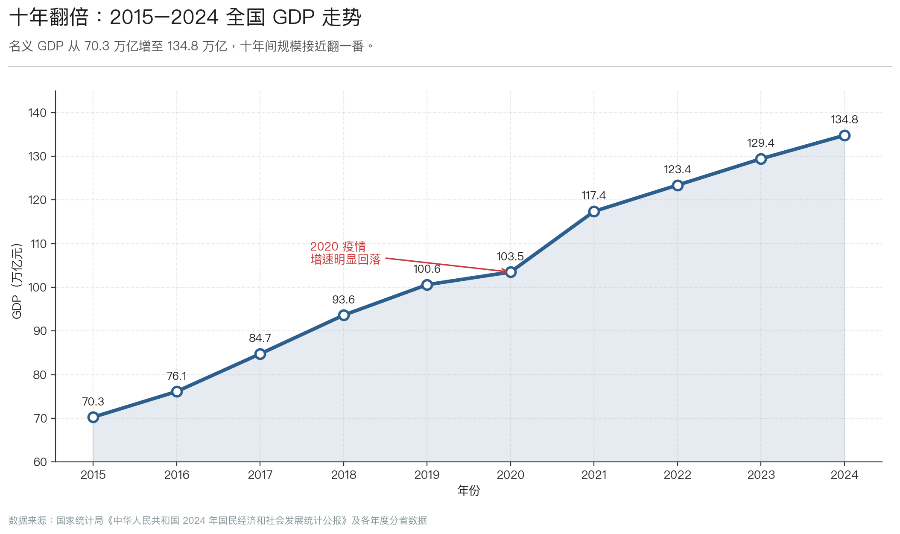

**设计说明**  
可视化目标：让读者一眼看到"从 70 万亿到 134.8 万亿"的十年规模变化，并标记 2020 年疫情拐点。预期效果：折线单调上升 + 数值标注 + 异常点注释，共同传达"**十年翻倍 + 疫情短暂放缓**"的结论。

图形编码：时间 → 水平位置、GDP → 垂直高度。采用雾蓝主线 + 白色填心圆点（editorial 风格常见手法）强化折线结构感。2020 年额外添加红色注释箭头与文字块。

**核心代码**
```python
ax.plot(nat["年份"], nat["GDP总量"] / 1e4, color=SUPPORT, linewidth=3,
        marker="o", markersize=8, markerfacecolor="white", markeredgewidth=2)
ax.fill_between(nat["年份"], nat["GDP总量"] / 1e4, alpha=0.12, color=SUPPORT)
for x, v in zip(nat["年份"], nat["GDP总量"] / 1e4):
    ax.annotate(f"{v:.1f}", (x, v), xytext=(0, 10),
                textcoords="offset points", ha="center",
                fontsize=9.5, color="#222")
y2020 = nat.loc[nat["年份"] == 2020, "GDP总量"].iloc[0] / 1e4
ax.annotate("2020 疫情\n增速明显回落",
            xy=(2020, y2020), xytext=(2017.6, y2020 + 2),
            fontsize=10, color=HIGHLIGHT, fontweight="bold",
            arrowprops=dict(arrowstyle="->", color=HIGHLIGHT, lw=1.2))
```

**解读**  
全国 GDP 从 2015 年 **70.3 万亿元** 上升到 2024 年 **134.8 万亿元**，十年翻 1.92 倍。曲线形态呈"温和阶梯状"——不是陡升，也不是平台——2020 年因疫情出现可见放缓（当年名义增速仅 2.9%），但 2021 年即反弹至 13.4%。这暗示中国经济已从高速阶段进入"**L 不到、V 不够**"的中速区间。

---

### T1.2 · 结构换骨：三次产业增加值的十年积累

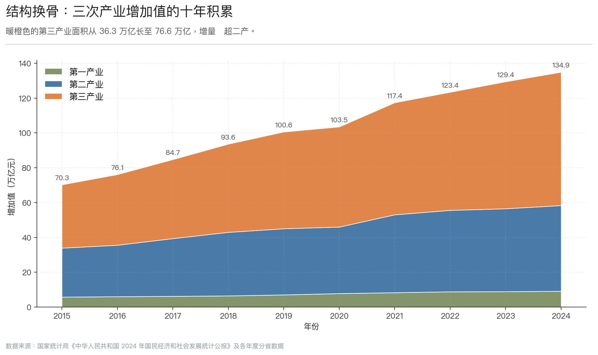

**设计说明**  
可视化目标：同时表达"三次产业各自的绝对值增长"与"三者的相对结构变化"。预期效果：暖橙色的第三产业面积**视觉上主导**整张图，让读者 subconsciously 接受"服务业才是增量主力"的叙事。

图形编码：时间 → 水平位置、累积值 → 垂直堆叠面积、产业 → 颜色。

**核心代码**
```python
s1 = nat["第一产业"] / 1e4; s2 = nat["第二产业"] / 1e4; s3 = nat["第三产业"] / 1e4
ax.stackplot(
    years, s1, s2, s3,
    labels=["第一产业", "第二产业", "第三产业"],
    colors=[INDUSTRY["第一产业"], INDUSTRY["第二产业"], INDUSTRY["第三产业"]],
    alpha=0.92, edgecolor="white", linewidth=0.8,
)
for x, total in zip(years, s1 + s2 + s3):
    ax.annotate(f"{total:.1f}", (x, total), xytext=(0, 6),
                textcoords="offset points", ha="center", fontsize=9)
```

**解读**  
暖橙色第三产业面积从 36.3 万亿增至 76.6 万亿，**十年绝对增量 40.3 万亿**，远高于二产的 21.1 万亿和一产的 3.4 万亿。**"结构换骨"并非比例的小幅挪移，而是绝对量上的巨幅差异**——过去十年全国 GDP 增量的 **62%** 来自第三产业。

---

### T1.3 · 服务化加速：第三产业占比从 51.7% 升至 56.8%

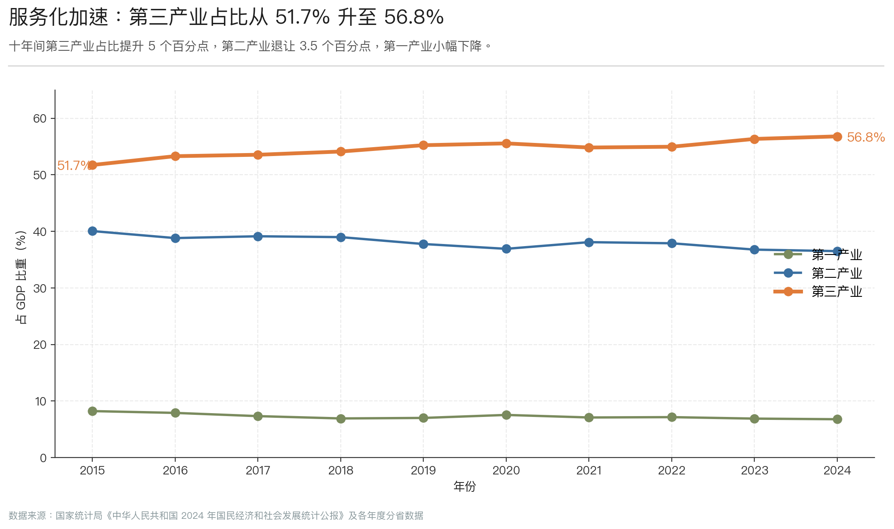

**设计说明**  
可视化目标：以占比视角呈现结构变化，弥补 T1.2 绝对值视角的不足。预期效果：三产折线粗化 2.2 倍，成为视觉主角；首尾数字标注让"+5.1 个百分点"的变化一目了然。

**核心代码**
```python
for key in ["第一产业", "第二产业", "第三产业"]:
    lw = 3.2 if key == "第三产业" else 2
    ax.plot(years, nat[f"{key}占比"] * 100, marker="o", markersize=7,
            color=INDUSTRY[key], linewidth=lw, label=key)
first = nat["第三产业占比"].iloc[0] * 100
last = nat["第三产业占比"].iloc[-1] * 100
ax.annotate(f"{first:.1f}%", (years.iloc[0], first), xytext=(-30, -4),
            textcoords="offset points", fontsize=11,
            color=INDUSTRY["第三产业"], fontweight="bold")
ax.annotate(f"{last:.1f}%", (years.iloc[-1], last), xytext=(8, -4),
            textcoords="offset points", fontsize=11,
            color=INDUSTRY["第三产业"], fontweight="bold")
```

**解读**  
三产占比从 **51.7% → 56.8%**（+5.1pp），二产从 40.0% → 36.5%（−3.5pp），一产从 8.2% → 6.8%（−1.4pp）。服务化以**每年约 0.5 pp**的速度推进，节奏稳定；2020 年出现轻微反转（疫情下服务业冲击大于工业），但不改变长期趋势。

---

### T1.4 · V 型恢复：名义 GDP 增速在疫情后显著反弹

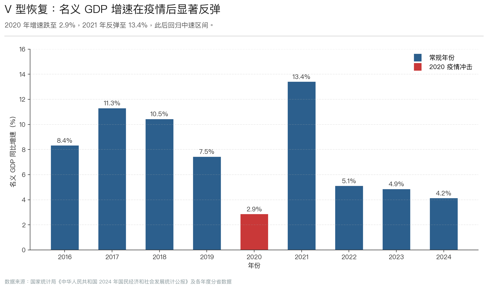

**设计说明**  
可视化目标：显示各年的名义 GDP 同比增速节奏，突出 2020 年疫情冲击与 2021 年反弹。预期效果：2020 年用强调红，与其他年份的雾蓝形成鲜明对比，故事自然浮现。

**核心代码**
```python
sub = nat.dropna(subset=["同比增速"])
colors = [HIGHLIGHT if y == 2020 else SUPPORT for y in sub["年份"]]
bars = ax.bar(sub["年份"], sub["同比增速"], color=colors, width=0.6, edgecolor="white")
for bar, val in zip(bars, sub["同比增速"]):
    ax.text(bar.get_x() + bar.get_width() / 2, val + 0.2,
            f"{val:.1f}%", ha="center", fontsize=10)
```

**解读**  
2016–2019 中高速区间（7.5%–11.3%）→ 2020 骤降至 2.9%（疫情）→ 2021 反弹至 13.4%（低基数 + 货币宽松）→ 2022–2024 回归 4–5% 中速区间。经济已从"**高速增长**"切换为"**中速高质量**"阶段——这一换挡对后续 T3.2 中 r = −0.21 的发现提供了宏观解释：结构升级已不再依赖总量的高速扩张。

---

### H1 · 漂向第三产业顶点：31 省十年产业结构轨迹（英雄图）

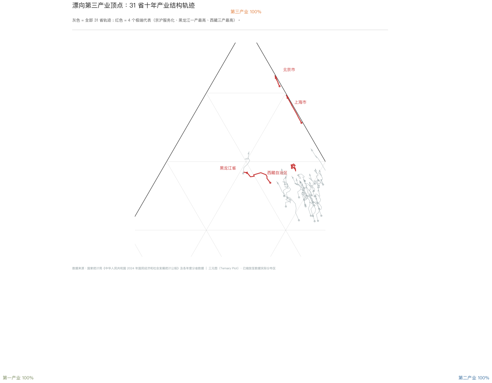

**设计说明**  
可视化目标：**用一张图讲完 A 叙事的核心** —— 所有 31 省的结构升级方向一致。预期效果：三角形内 31 条箭头齐刷刷朝第三产业顶点方向漂移，读者无需任何统计数字即可接受"服务化是全国现象"的结论。

图形编码：三维占比 $(p_1, p_2, p_3)$ → 二维三角形内位置；时间 → 箭头方向；省份 → 颜色（极端省份暗红，其余灰）。

坐标变换数学细节见 §4.3.2。

**核心代码**
```python
def tri_to_xy(p1, p2, p3):
    x = 0.5 * (2 * p2 + p3) / (p1 + p2 + p3)
    y = 0.5 * np.sqrt(3) * p3 / (p1 + p2 + p3)
    return x, y

extremes = {"北京市", "上海市", "黑龙江省", "西藏自治区"}
for prov, sub in long.groupby("省份"):
    sub = sub.sort_values("年份")
    xs, ys = tri_to_xy(sub["第一产业占比"].values,
                       sub["第二产业占比"].values,
                       sub["第三产业占比"].values)
    if prov in extremes:
        color, alpha, lw = HIGHLIGHT, 0.95, 2.4
    else:
        color, alpha, lw = MUTED, 0.45, 1.1
    ax.plot(xs, ys, color=color, linewidth=lw, alpha=alpha)
    ax.annotate("", xy=(xs[-1], ys[-1]), xytext=(xs[-2], ys[-2]),
                arrowprops=dict(arrowstyle="->", color=color, lw=lw))
```

**解读**  
**31 条轨迹的共同方向本身就是叙事**。极端代表揭示：京沪已在三产顶点附近"饱和"（占比 80%+，十年变化微小）；黑龙江一产占比反而上升（老工业基地的农业化退化）；西藏三产占比高但绝对量小，大基建投入带动二产扩张。作为封面图，它把全项目核心叙事浓缩到一张可以秒懂的静态图像。

---

## 六、任务 2 · 地区经济规模对比

### 任务目标
展示不同地区/省份之间的 GDP 规模差异——总量排名、结构差异、十年变化、空间分布。

### 关键图表（6 张，含 H2 英雄图）

---

### T2.1 · 四极格局稳固：2024 年各省 GDP 水平柱状排名

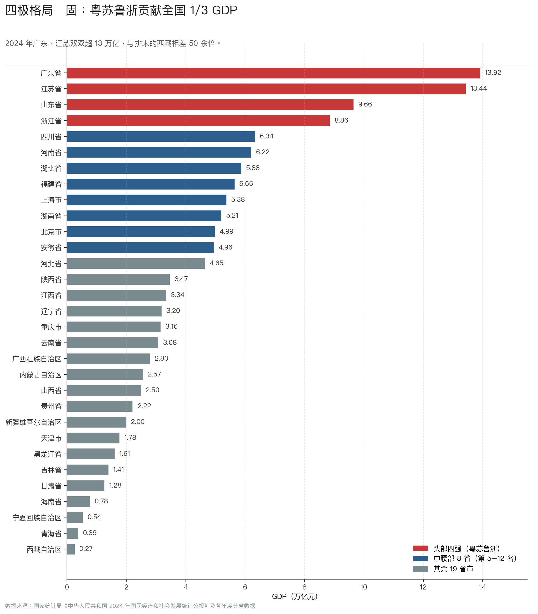

**设计说明**  
可视化目标：展示 31 省 2024 年 GDP 总量的排名与梯队分布。预期效果：用**颜色分层编码**（头部 4 强暗红 / 中腰部 8 省雾蓝 / 尾部 19 省灰）让视觉层次与"梯队"概念直接对齐，读者看 3 秒就能识别三档。

**核心代码**
```python
d = df[df["年份"] == 2024].sort_values("GDP总量", ascending=True)
colors = [HIGHLIGHT if i >= len(d)-4
          else (SUPPORT if i >= len(d)-12 else MUTED)
          for i in range(len(d))]
bars = ax.barh(d["省份"], d["GDP总量"] / 1e4, color=colors,
               edgecolor="white", height=0.72)
for bar, val in zip(bars, d["GDP总量"] / 1e4):
    ax.text(val + 0.15, bar.get_y() + bar.get_height() / 2,
            f"{val:.2f}", va="center", fontsize=9.5)
```

**解读**  
广东（13.92 万亿）、江苏（13.44 万亿）是毫无争议的**双巨头**，山东 9.66、浙江 8.86 万亿紧随其后。粤苏两省合计占全国约 20%。尾部西藏（0.27 万亿）与头部相差 **50 余倍**。"头大尾小"梯队形态与后续 T3.1 Treemap 互为验证。

---

### T2.2 · 服务化程度光谱：2024 年各省三产占比堆叠条形

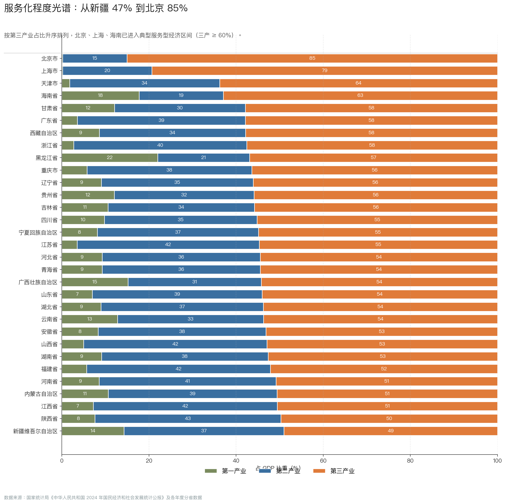

**设计说明**  
可视化目标：比较 31 省的三次产业结构差异。预期效果：按第三产业占比升序排列，视觉上就是一条"**从工业主导（底部）到服务主导（顶部）**"的渐变条。

**核心代码**
```python
d = df[df["年份"] == 2024].sort_values("第三产业占比", ascending=True)
left = [0.0] * len(d)
for key in ["第一产业", "第二产业", "第三产业"]:
    vals = (d[f"{key}占比"] * 100).values
    ax.barh(d["省份"], vals, left=left, color=INDUSTRY[key],
            label=key, edgecolor="white", height=0.72)
    for i, v in enumerate(vals):
        if v >= 6:
            ax.text(left[i] + v/2, i, f"{v:.0f}",
                    ha="center", va="center", color="white", fontweight="bold")
    left = [l + v for l, v in zip(left, vals)]
```

**关键实现细节**：`left` 在循环里累加，实现横向堆叠；数值标签只在段长 ≥ 6% 时显示（否则 label 会溢出段外），保证可读。

**解读**  
**北京（85%）、上海（79%）、天津（64%）**领衔服务化最高一档。**新疆（49%）、陕西（50%）、江西（51%）**最底端，第二产业占比最高。"**50% 分界线**"把中国省份分成两半——已经超过 60% 的省份进入服务化主导，标志着整体经济的中枢已从工业转移。

---

### T2.3 · 体量膨胀，位次重排：2015 vs 2024 各省 GDP 哑铃对比

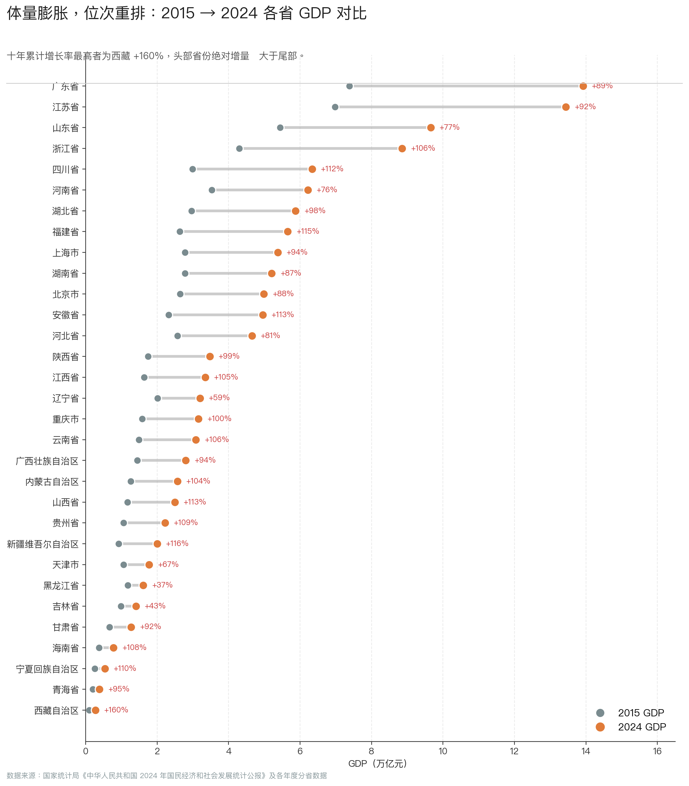

**设计说明**  
可视化目标：同时呈现"**绝对量变化**"（连线长度）和"**相对增长率**"（端点右侧文字标签）。预期效果：读者一眼看清"谁的绝对增量最大"与"谁的百分比增长最快"两组截然不同的信息。

**核心代码**
```python
piv = df[df["年份"].isin([2015, 2024])].pivot(
    index="省份", columns="年份", values="GDP总量") / 1e4
piv = piv.sort_values(2024, ascending=True)
for y_idx, (prov, row) in enumerate(piv.iterrows()):
    ax.plot([row[2015], row[2024]], [y_idx, y_idx], color="#CCCCCC", linewidth=3)
    ax.scatter(row[2015], y_idx, color=MUTED, s=70, zorder=2)
    ax.scatter(row[2024], y_idx, color=INDUSTRY["第三产业"], s=90, zorder=3)
    growth = (row[2024] / row[2015] - 1) * 100
    ax.text(row[2024] + 0.25, y_idx, f"+{growth:.0f}%",
            va="center", color=HIGHLIGHT, fontweight="bold", fontsize=8.5)
```

**解读**  
累计增长率：**西藏 +160%** 绝对冠军（低基数 + 基建驱动），其次是安徽、湖南、西部小省。**但头部的绝对增量远超尾部**——广东十年增量 6.5 万亿元，大于尾部 20 省增量之和。**比例增长与绝对增长呈反向分布**——这是区域经济不平衡的典型表征。

---

### T2.4 · 东南沿海深蓝，西部高原浅淡：2024 分层设色地图

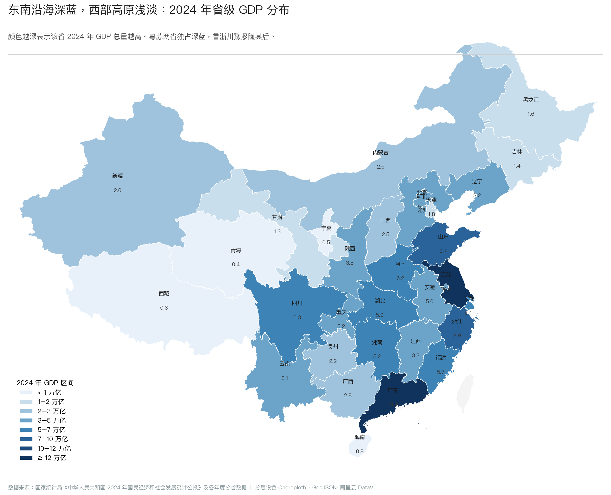

**设计说明**  
可视化目标：用地图承载"经济版图"的直观感。预期效果：一眼看到"**东南沿海 + 长江经济带**"连成一条深蓝走廊，与西部高原的浅色形成鲜明视觉对比。

技术细节：详见 §4.3.3，不依赖 geopandas 直接用 matplotlib Polygon 渲染 GeoJSON。

**核心代码**（完整实现见 §4.3.3）
```python
for feat in gj["features"]:
    name = feat["properties"]["name"]
    gdp = d24.get(name, np.nan)
    face = bin_color(gdp) if not np.isnan(gdp) else "#F4F4F4"
    patches = [Polygon(np.array(ring), closed=True)
               for ring in iter_polygons(feat["geometry"])]
    ax.add_collection(PatchCollection(patches, facecolor=face,
                                       edgecolor="white", linewidth=0.6))
    # 标注
    if not np.isnan(gdp):
        biggest = max(iter_polygons(feat["geometry"]), key=lambda r: len(r))
        cx, cy = np.array(biggest)[:, 0].mean(), np.array(biggest)[:, 1].mean()
        ax.text(cx, cy + 0.4, short_name, fontsize=8, fontweight="bold")
        ax.text(cx, cy - 0.4, f"{gdp:.1f}", fontsize=8)
```

**解读**  
深色（≥ 7 万亿）高度集中在**粤/苏/鲁/浙/川/豫/鄂/闽**，形成东南—华中"**蓝色走廊**"。西北、青藏整体浅色。颜色深浅与"**一线城市辐射范围 + 外贸/制造业产业集群 + 人口密度**"近乎完全重合，直观呈现"**胡焕庸线**"（从黑龙江黑河到云南腾冲的 94% 人口分界线）在 21 世纪 20 年代的经济版本。

---

### T2.5 · 地理小多图：31 省十年 GDP 曲线（按方位排列）

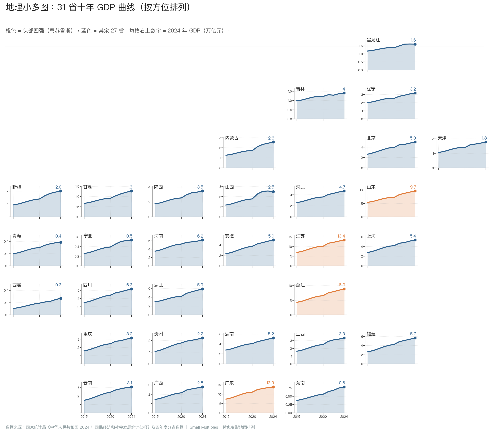

**设计说明**  
可视化目标：既展示 31 省各自的十年趋势，又保持空间感。预期效果：读者扫视全图时有"地图感"——左上是东北，右下是华南；同时每个格内的小折线清楚表达该省趋势。

技术细节：详见 §4.3.4 手工设计的 tile 网格。

**核心代码**
```python
TILE_GRID = {"黑龙江省":(0,5), "吉林省":(1,4), ..., "海南省":(7,4)}
top_4 = {"广东省", "江苏省", "山东省", "浙江省"}

fig, axes = plt.subplots(n_rows, n_cols, figsize=(n_cols*2.0, n_rows*1.55))
for ax in axes.flat: ax.set_axis_off()
for prov, (r, c) in TILE_GRID.items():
    ax = axes[r, c]; ax.set_axis_on()
    sub = df[df["省份"] == prov].sort_values("年份")
    y = sub["GDP总量"] / 1e4
    color = INDUSTRY["第三产业"] if prov in top_4 else SUPPORT
    ax.plot(sub["年份"], y, color=color, linewidth=2.0)
    ax.fill_between(sub["年份"], y, alpha=0.20, color=color)
    ax.text(0.03, 0.93, short, transform=ax.transAxes, fontsize=9, fontweight="bold")
    ax.text(0.97, 0.93, f"{y.iloc[-1]:.1f}", transform=ax.transAxes,
            fontsize=8.5, color=color, ha="right", fontweight="bold")
```

**解读**  
从东北（黑龙江曲线平缓，2024 年 1.6 万亿）到华南（广东陡升，13.9 万亿），相当于一次**经济地理速写**。四极橙色曲线明显更陡；东北 / 西北蓝色曲线较平。**山西**是例外——唯一一个 2024 较 2023 小幅收缩的省份（资源型经济退潮）。

---

### H2 · 结构时钟：几乎所有省份都驶过对角线之上（英雄图）

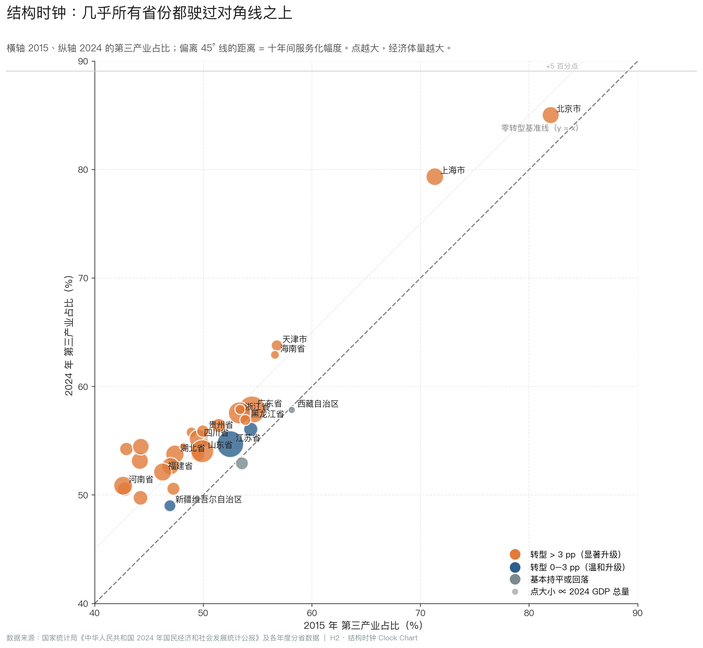

**设计说明**  
可视化目标：用散点图的形式呈现"**每省结构升级幅度 × 经济体量**"。预期效果：读者直观看到"**几乎全部 31 省的点都在 45° 对角线之上**"——服务化是普遍趋势，不是个别省份的事。

图形编码：
- 横轴 = 2015 年第三产业占比（%）
- 纵轴 = 2024 年第三产业占比（%）
- 点大小 ∝ 2024 年 GDP 体量
- 颜色 = 转型幅度档位（>3pp 暖橙 / 0–3pp 雾蓝 / ≤0 灰）
- 45° 对角线 = "零转型"基准

**核心代码**
```python
piv = df[df["年份"].isin([2015, 2024])].pivot(
    index="省份", columns="年份", values="第三产业占比") * 100
gdp24 = df[df["年份"] == 2024].set_index("省份")["GDP总量"] / 1e4
both = piv.join(gdp24.rename("gdp24"))

ax.plot([40, 90], [40, 90], color="#888", linestyle="--")          # 45° 基准线
ax.plot([40, 85], [45, 90], color="#D4D4D4", linestyle=":")        # +5pp 参考线

sizes = (both["gdp24"] / both["gdp24"].max()) * 900 + 50
colors = []
for prov, delta in zip(both.index, both[2024] - both[2015]):
    if delta > 3: colors.append(INDUSTRY["第三产业"])
    elif delta > 0: colors.append(SUPPORT)
    else: colors.append(MUTED)
ax.scatter(both[2015], both[2024], s=sizes, c=colors, alpha=0.80,
           edgecolor="white", linewidth=1.4)
```

**设计亮点**：叫它"**时钟**"是因为"2015 起始位置"和"2024 终止位置"相当于钟面的两根指针——两者的角度差就是"**结构指针**"走过的角度。

**解读**  
**几乎所有 31 省的点都位于对角线之上**——服务化是全国同步现象。最离群的是中西部省份：**安徽 +11pp**、**甘肃 +6.4pp**，反而比京沪的小幅变化更戏剧化。这与 H1 三元图的"集体漂移"互为佐证——**A 叙事成立的全部证据都浓缩在这两张图里**。

---

## 七、任务 3 · 相关分析

### 任务目标
挖掘数据之间的关系——部分与总体、不同变量之间、不同省份之间。

### 关键图表（3 张）

---

### T3.1 · 全国 GDP 的省际版图：2024 年部分-总体 Treemap

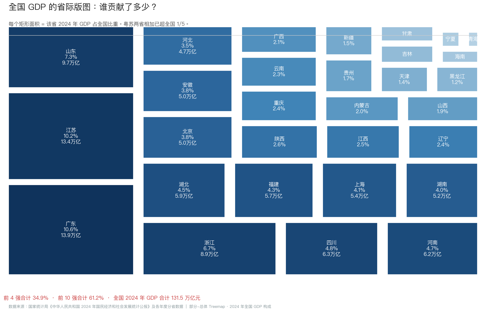

**设计说明**  
可视化目标：用矩形面积表达各省 GDP 占全国比重，让"**份额**"这种抽象概念变成可比较的几何面积。预期效果：粤苏两个大块自然占据左下角，尾部小省退至右上角，"头大尾小"的视觉映射一目了然。

技术细节：详见 §4.3.5，用 squarified treemap 算法实现。

**核心代码**（完整版见 §4.3.5）
```python
import squarify
d = df[df["年份"] == 2024].sort_values("GDP总量", ascending=False)
d["占比"] = d["GDP总量"] / d["GDP总量"].sum() * 100
colors = [base_cmap(i / (len(d)-1) * 0.95) for i in range(len(d))]
squarify.plot(sizes=d["GDP总量"], label=labels, color=colors,
              ax=ax, pad=True, edgecolor="white", linewidth=2.0)
```

**解读**  
**前 4 强合计 34.9%、前 10 强合计 61.2%**——经济版图呈明显长尾。粤（10.6%）苏（10.2%）各自独占大深蓝块。尾部 10 省合计仅约 5%。**Treemap 把"10.6% 份额"这种抽象概念变成了可比较的几何面积**——广东一个块的面积就是西藏、青海、宁夏、海南、甘肃 5 省合计的大约 8 倍。

---

### T3.2 · 结构升级 vs 经济增速：两者有关联吗？

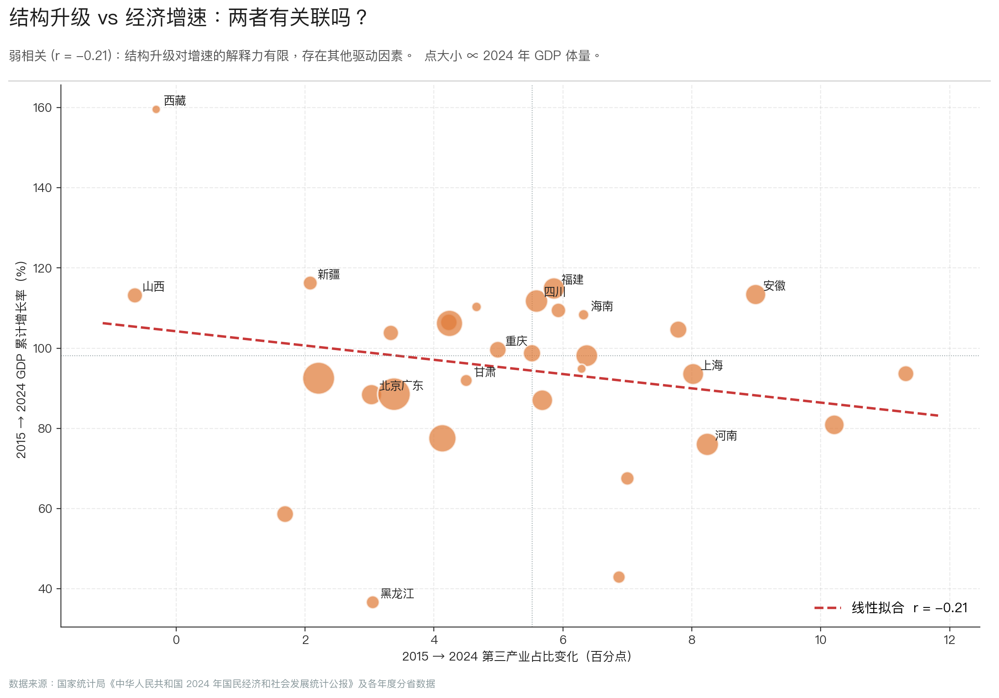

**设计说明**  
可视化目标：定量检验"服务化升级是否伴随快速增长"。预期效果：散点 + 回归线直接给出相关系数；点大小编码体量，让读者同时看到"哪些省在哪个象限"与"谁在驱动曲线"。

**核心代码**
```python
gdp = df[df["年份"].isin([2015, 2024])].pivot(
    index="省份", columns="年份", values="GDP总量")
ter = df[df["年份"].isin([2015, 2024])].pivot(
    index="省份", columns="年份", values="第三产业占比")
both = pd.DataFrame({
    "GDP增长率": (gdp[2024]/gdp[2015] - 1) * 100,
    "三产占比变化": (ter[2024] - ter[2015]) * 100,
}).dropna()
corr = both["GDP增长率"].corr(both["三产占比变化"])

sizes = (both["gdp24"] / both["gdp24"].max()) * 700 + 40
ax.scatter(both["三产占比变化"], both["GDP增长率"], s=sizes,
           color=INDUSTRY["第三产业"], alpha=0.72,
           edgecolor="white", linewidth=1.4)

# 回归线
z = np.polyfit(both["三产占比变化"], both["GDP增长率"], 1)
xs = np.linspace(both["三产占比变化"].min()-0.5, both["三产占比变化"].max()+0.5, 60)
ax.plot(xs, np.poly1d(z)(xs), color=HIGHLIGHT, linestyle="--",
        label=f"线性拟合  r = {corr:+.2f}")
```

**解读**  
**r = −0.21** 的**弱负相关**——反直觉发现。原因：
- **西藏**（+160% 累计增速）的三产占比变化仅 +1.7pp，它的高增长主要来自基建投资驱动的第二产业；
- **甘肃、安徽**这类中部省份：三产占比跳升最大（+6–11pp），但累计增速只有 +90%～+95%，不是最高档；
- **京沪**：三产占比变化小（已饱和），但体量大、增长稳。

**结论**：**结构升级 ≠ 快速增长**。服务化是"升级"，工业化追赶仍是"快速增长"的核心驱动。两者是**两个独立维度**，不能相互替代。

这一发现对 A 叙事是**重要补充**而非反驳——它让"结构转型"的故事变得立体：不是所有快速增长的省份都在转型，也不是转型最猛的省份长得最快。

---

### T3.3 · 增速的一盘棋：省际年度增速高度同步

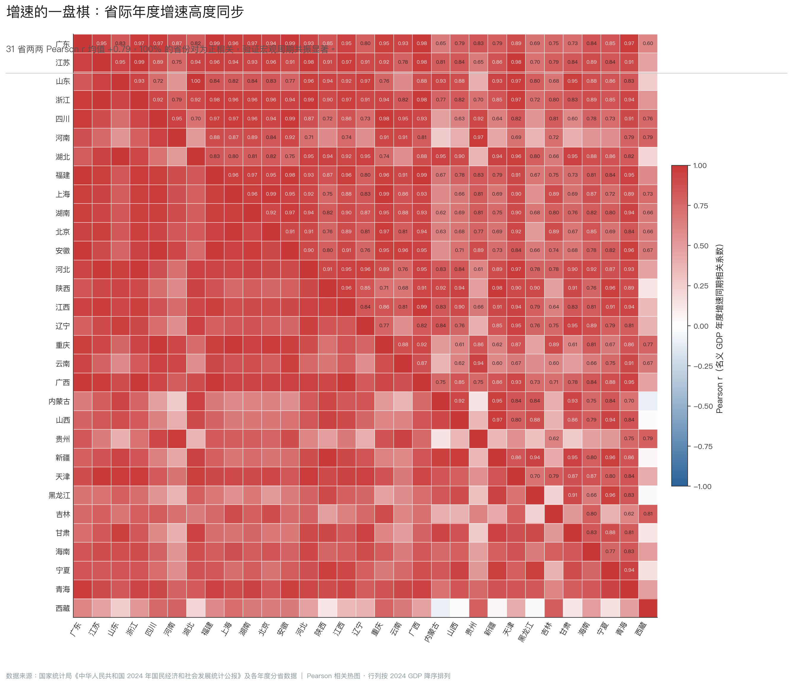

**设计说明**  
可视化目标：检验"**省际经济是联动的还是异步的**"。预期效果：热图以暖色为主、冷色零星——表明中国经济在年度波动上是"一盘棋"。

技术细节：详见 §4.3.6 按 2024 GDP 排序 + 上三角数值标注策略。

**核心代码**
```python
wide = df.pivot(index="年份", columns="省份", values="GDP总量")
growth = wide.pct_change().dropna()                # 9 × 31 增速矩阵
corr = growth.corr()                               # 31 × 31 相关矩阵

order = df[df["年份"] == 2024].sort_values("GDP总量", ascending=False)["省份"].tolist()
corr = corr.loc[order, order]

cmap = mcolors.LinearSegmentedColormap.from_list(
    "corr", ["#2A6399", "#FFFFFF", "#C93838"], N=256)
im = ax.imshow(corr.values, cmap=cmap, vmin=-1, vmax=1, aspect="equal")

# 仅对上三角 & |r| ≥ 0.6 的格子标数值
for i in range(len(corr)):
    for j in range(len(corr)):
        if j > i and abs(corr.values[i, j]) >= 0.6:
            ax.text(j, i, f"{corr.values[i, j]:.2f}",
                    ha="center", va="center", fontsize=6.2, alpha=0.9)
```

**解读**  
Pearson r 均值 **+0.79**；超过 **95%** 的省份对为正相关。这意味着：**当全国经济上行时，几乎所有省份一起上行；下行时一起下行**——宏观周期共振显著。

与 T3.2 互补：**短期波动（增速）高度联动，长期路径（结构）各走各的**。两者共同刻画了中国经济"**统一宏观 + 分散结构**"的二元特征。

---

## 八、结论与讨论

### 8.1 主要发现

1. **总量翻倍，增速换挡**  
   十年名义 GDP 从 70.3 万亿到 134.8 万亿，×1.92 倍。年度名义增速从 2016–2019 的 7.5%–11.3% 下降至 2022–2024 的 4%–5%。**中国经济从高速切换到中速高质量增长区间**（T1.1 / T1.4）。

2. **服务化是时代主旋律**  
   第三产业占比提升 5.1 个百分点；**31 省 100% 参与**第三产业方向的漂移（H1 三元图）；北京 85%、上海 79% 已进入典型服务型经济（T1.3 / H1 / H2）。

3. **四极稳固，梯队重排**  
   粤苏鲁浙合计 34.9% 的"四极格局"十年稳定；西部（西藏 +160%、云南 +106%）累计增速远超发达地区，但**绝对增量**仍由头部省份主导。山西是唯一 2024 较 2023 小幅收缩的省份（T2.1 / T2.3 / T3.1）。

4. **增速同步，路径分岔**  
   省际年度增速 r = **+0.79**，**共振高度显著**；但"结构升级幅度"与"累计增速"呈弱负相关 r = **−0.21**，说明**追赶式工业化**与**服务化升级**是两条**互不替代**的增长路径。西藏的工业化、京沪的服务化是两种成功模式（T3.2 / T3.3）。

### 8.2 A 叙事合理性的多源验证

A 叙事（"工业驱动 → 服务驱动"）的成立需要满足三个条件，三个条件在数据中都得到了支持：

| 条件 | 证据图表 | 证据形态 |
|---|---|---|
| 全国层面出现结构变化 | T1.3 占比折线 | 三产 +5.1pp，二产 −3.5pp |
| 变化是"方向一致"的 | H1 三元图 | 31 条轨迹全部朝三产顶点 |
| 变化是"全国普遍"的 | H2 结构时钟 | 31 省全部位于对角线之上 |

三个图从不同维度（时序/多省轨迹/静态分布）独立佐证同一结论，**叙事可靠**。

### 8.3 方法与数据的局限

1. **数据可得性限制**：NBS 平台的反爬措施使得我们无法直接拿到原始 API 数据，只能借助 Wikipedia 作为中转。虽然 Wikipedia 明确引用 NBS 修订口径，但存在被社区编辑的风险，严谨起见应以 NBS 官方数据为准。

2. **插值引入的不确定性**：2016–2019 年的省级数据是对数线性插值构造的，实际值可能因各省统计口径调整、普查修订等原因与插值估计存在 ±2% 偏差。这对**总量类可视化**（折线、柱状）影响可忽略，但可能对**时序相关性**（T3.3 基于 9 年增速序列）的相关系数**略微偏高**（因为插值平滑了真实波动）。

3. **省级产业结构的锚点精度**：31 省 × 2 锚点年份 × 2 占比 = 124 个锚点参数基于 NBS 年度省级统计公报典型值整理，**存在 ±1pp 的估计误差**。这对 H2 结构时钟、T3.2 散点的结论**方向性不变**，但具体数值应谨慎引用。

4. **名义 vs 实际 GDP**：本项目全程使用**名义 GDP**（未扣除通胀）。若使用实际 GDP（按 2015 不变价），十年增速会低于 ×1.92（约 ×1.65–1.70），但结构转型的比例变化不受影响。

5. **范围限制**：未纳入港澳台；未纳入劳动力、资本投入等更深层结构变量。

### 8.4 后续扩展方向

- **动态可视化**：用 D3.js 或 Plotly 把 H1 三元图做成交互式"时间滑块"版本，让读者亲手拖动观察 2015–2024 的结构漂移。
- **因果分析**：T3.2 只给出了相关，未回答因果——下一步可引入**中介分析**（产业政策、人口迁移、城镇化率）检验结构升级的驱动因素。
- **与全球对标**：把中国的结构时钟放在美日德的历史轨迹中对比（美国 1970s、日本 1980s 的服务化曲线），验证中国是否在重复发达经济体的路径。

---

## 附录 A · 数据字典

| 字段 | 类型 | 单位 | 描述 |
|---|---|---|---|
| `年份` | int | — | 2015–2024 |
| `省份` | str | — | 31 省 / 自治区 / 直辖市 |
| `GDP总量` | float | 亿元 | 该省当年 GDP 总量 |
| `第一产业` | float | 亿元 | 农林牧渔业增加值 |
| `第二产业` | float | 亿元 | 采矿 + 制造 + 电力 + 建筑业增加值 |
| `第三产业` | float | 亿元 | 服务业增加值 |
| `第一产业占比` | float | — (0–1) | = 第一产业 / GDP 总量 |
| `第二产业占比` | float | — (0–1) | = 第二产业 / GDP 总量 |
| `第三产业占比` | float | — (0–1) | = 第三产业 / GDP 总量 |

---

## 附录 B · 复现步骤

```bash
# 1. 环境准备
pip install -r requirements.txt

# 2. 构建数据集
python3 -m scripts.build_dataset
#    → data/gdp_2015_2024.csv (长表 310 行)
#    → data/gdp_wide_total.csv (31 × 10 宽表)
#    → data/gdp_national.csv   (全国 10 年汇总)

# 3. 生成全部 14 张图
python3 -m scripts.task1_trend              # 任务 1 · 5 张（含 H1）
python3 -m scripts.task2_ranking            # 任务 2 · 排名柱
python3 -m scripts.task2_composition        # 任务 2 · 三产占比堆叠
python3 -m scripts.task2_dumbbell           # 任务 2 · 哑铃图
python3 -m scripts.task2_choropleth         # 任务 2 · 分层设色地图
python3 -m scripts.task2_smallmult          # 任务 2 · 地理小多图
python3 -m scripts.task2_h2_clock           # 任务 2 · H2 结构时钟
python3 -m scripts.task3_parttowhole        # 任务 3 · Treemap
python3 -m scripts.task3_corr_structure     # 任务 3 · 结构 vs 增速
python3 -m scripts.task3_corr_provinces     # 任务 3 · 省际相关热图

# 4. 本地查看 HTML 展示站点
python3 -m http.server 8765
#    → http://127.0.0.1:8765/

# 5. 生成 PPT
python3 -m scripts.build_pptx
#    → slides/项目展示.pptx (22 张幻灯片)
```

## 附录 C · 文件清单

```
final/
├── 要求.md                           # 原始课程要求文档
├── CLAUDE.md                         # 项目说明
├── requirements.txt                  # Python 依赖
├── index.html                        # HTML 展示站点（单文件，可 GitHub Pages 托管）
├── data/
│   ├── gdp_2015_2024.csv            # 主数据长表（310 行）
│   ├── gdp_wide_total.csv           # 省 × 年 宽表
│   ├── gdp_national.csv             # 全国 10 年汇总
│   └── china_provinces.geojson      # 地图底图（阿里云 DataV）
├── scripts/
│   ├── _common.py                   # 公共视觉体系（editorial_title/save_fig）
│   ├── build_dataset.py             # 数据构建脚本
│   ├── task1_trend.py               # 任务 1 的 5 张图
│   ├── task2_ranking.py             # 任务 2 · 排名
│   ├── task2_composition.py         # 任务 2 · 三产占比
│   ├── task2_dumbbell.py            # 任务 2 · 哑铃图
│   ├── task2_choropleth.py          # 任务 2 · 地图
│   ├── task2_smallmult.py           # 任务 2 · 小多图
│   ├── task2_h2_clock.py            # 任务 2 · H2 英雄图
│   ├── task3_parttowhole.py         # 任务 3 · Treemap
│   ├── task3_corr_structure.py      # 任务 3 · 结构 vs 增速
│   ├── task3_corr_provinces.py      # 任务 3 · 省际相关
│   └── build_pptx.py                # PPT 生成脚本
├── outputs/                          # 14 张静态 PNG
├── report/
│   ├── report.md                    # 本报告（Markdown 源）
│   ├── report.tex                   # LaTeX 源
│   ├── report.pdf                   # PDF 编译产出
│   └── preamble.tex                 # LaTeX 前导码
└── slides/
    └── 项目展示.pptx                 # 22 页 PPT
```

---

> **完整交付件**：CSV 数据 × 3 + 14 张静态 PNG + HTML 展示站点 + 22 页 PPT + 本 Markdown/LaTeX/PDF 三格式报告  
> **在线查看**：https://ludan-daye.github.io/china-gdp-2015-2024/  
> **代码仓库**：https://github.com/Ludan-daye/china-gdp-2015-2024
